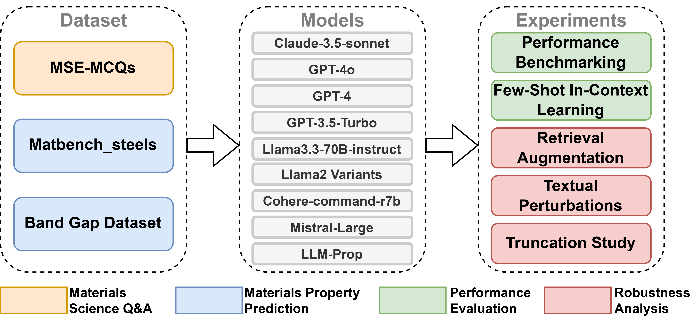

# Evaluating the Performance and Robustness of LLMs in Materials Science Q&A and Property Predictions

## Overview

This repository contains the dataset, analysis scripts, and results of a study evaluating the performance and robustness of various **Large Language Models (LLMs)** on **Materials Science** Question Answering (Q&A) and Property Predictions. The  is shown below.

## Data and Methods

### 1. Datasets


### 2. Models Evaluated

We benchmarked the following models:

- **OpenAI Models**: GPT-4o, GPT-4-0613, GPT-3.5-Turbo-0613
- **Anthropic Models**: Claude-3.5-Sonnet
- **Meta AI Models**: LLaMA-2-7B, LLaMA-2-13B, LLaMA-2-70B, LLaMA33-70B-Instruct
- **DeepSeek Models**: DeepSeek-R1

### 3. Evaluation Metrics


## Installation and Usage

To replicate the analysis:

```sh
# Clone this repository
git clone https://github.com/yourusername/llm-materials-science-eval.git
cd llm-materials-science-eval

# Install dependencies
pip install -r requirements.txt

# Run the analysis scripts
python scripts/analyze_results.py
```

## Citation

If you use this dataset or analysis in your research, please cite:

```bibtex
@misc{wang2024evaluatingperformancerobustnessllms,
      title={Evaluating the Performance and Robustness of LLMs in Materials Science Q&A and Property Predictions}, 
      author={Hongchen Wang and Kangming Li and Scott Ramsay and Yao Fehlis and Edward Kim and Jason Hattrick-Simpers},
      year={2024},
      eprint={2409.14572},
      archivePrefix={arXiv},
      primaryClass={cs.CL},
      url={https://arxiv.org/abs/2409.14572}, 
}
```

## Contact

For any questions or contributions, please open an issue or contact [**hongchen.wang@mail.utoronto.ca**](mailto:hongchen.wang@mail.utoronto.ca).
