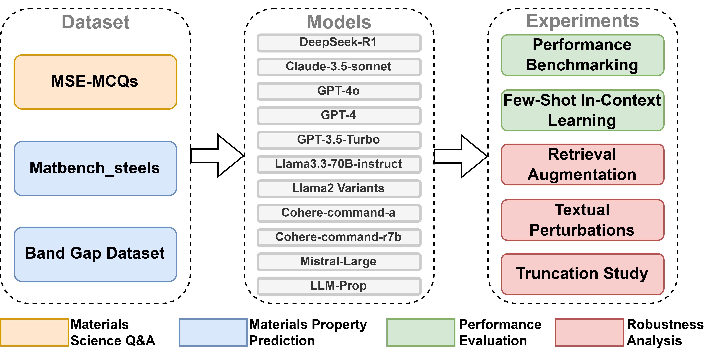

# Evaluating the Performance and Robustness of LLMs in Materials Science Q&A and Property Predictions

## Overview
Large Language Models (LLMs) have the potential to revolutionize scientific research, yet their robustness and reliability in domain-specific applications remain insufficiently explored. This study evaluates the **performance and robustness of LLMs for materials science**, focusing on **domain-specific question answering and materials property prediction** under diverse real-world and adversarial conditions.

This repository contains the dataset, analysis scripts, and results of the study for reproducibility purpose. 



## Datasets

1. **MSE-MCQs**  
   - **Source:** Univeristy of Toronto undergraduate materials science courses  
   - **Task:** Evaluating domain knowledge and reasoning skills of LLMs
   - **Size:** 113
   
2. **Matbench_steels**  
   - **Source:** [Matbench](https://matbench.materialsproject.org/)
   - **Task:** Predicting yield strength from steel compositions  
   - **Size:** 312
   
3. **Band Gap Dataset**  
   - **Source:** [The Materials Project](https://next-gen.materialsproject.org/)
   - **Task:** Predicting band gap values from textual descriptions ([LLM-Prop](https://github.com/vertaix/LLM-Prop.git)) of crystal structures generated using [Robocrystallographer](https://github.com/hackingmaterials/robocrystallographer.git)
   - **Size:** ~10,000
  
## Installation and Usage

To replicate the analysis:

```sh
# Clone this repository
git clone https://github.com/Toniaac/LLM-MSE-Eval-Robustness.git

# Run the jupyter notebook .ipynb files in their respective folders
```
To reproduce the figures in the paper, no inference needs to be run. Please just initialize and run the cells under "Plot" in each jupyter notebook. 

## Citation

If you use this dataset or analysis in your research, please cite:

```bibtex
@article{Wang_2025,
   title={Evaluating the performance and robustness of LLMs in materials science Q&amp;A and property predictions},
   volume={4},
   ISSN={2635-098X},
   url={http://dx.doi.org/10.1039/D5DD00090D},
   DOI={10.1039/d5dd00090d},
   number={6},
   journal={Digital Discovery},
   publisher={Royal Society of Chemistry (RSC)},
   author={Wang, Hongchen and Li, Kangming and Ramsay, Scott and Fehlis, Yao and Kim, Edward and Hattrick-Simpers, Jason},
   year={2025},
   pages={1612–1624} }
```

## Contact

For any questions or contributions, please contact [**hongchen.wang@mail.utoronto.ca**](mailto:hongchen.wang@mail.utoronto.ca).
